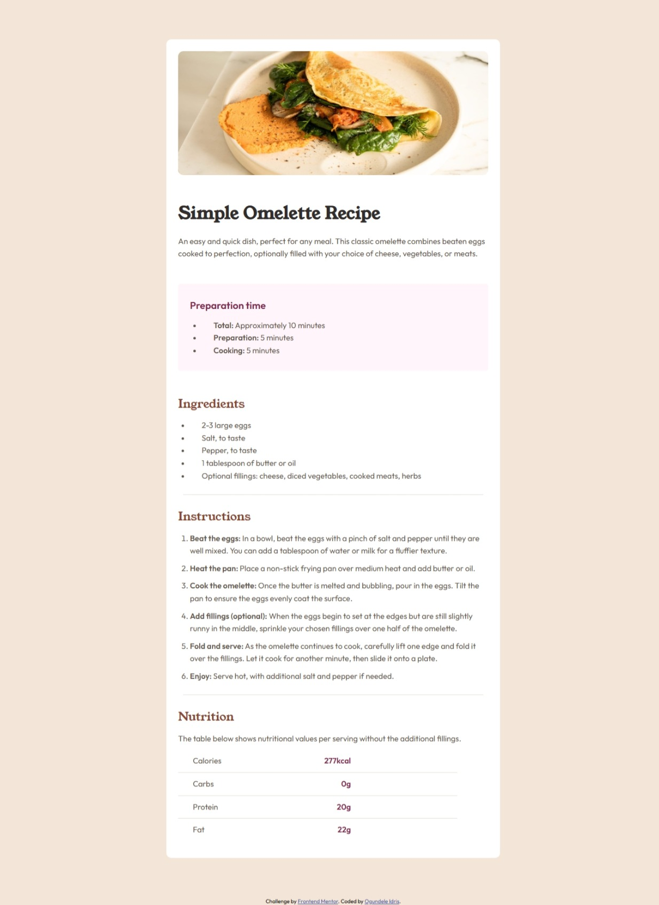
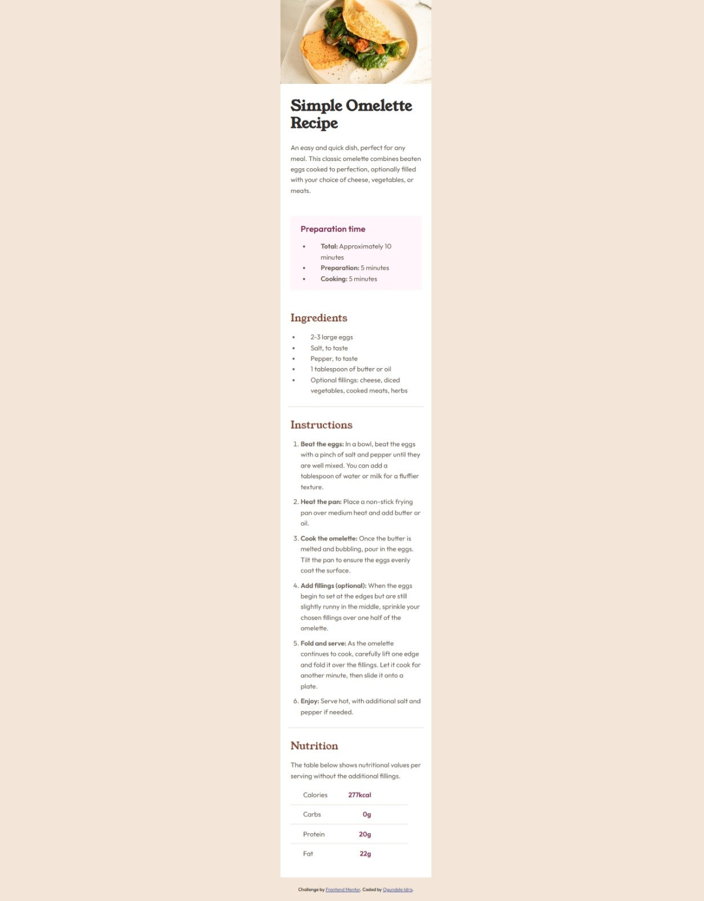

# Frontend Mentor - Recipe page solution

This is a solution to the [Recipe page challenge on Frontend Mentor](https://www.frontendmentor.io/challenges/recipe-page-KiTsR8QQKm). Frontend Mentor challenges help you improve your coding skills by building realistic projects.

## Table of contents

- [Overview](#overview)
  - [The challenge](#the-challenge)
  - [Screenshot](#screenshot)
  - [Links](#links)
- [My process](#my-process)
  - [Built with](#built-with)
  - [What I learned](#what-i-learned)
  - [Continued development](#continued-development)
  - [Useful resources](#useful-resources)
- [Author](#author)
- [Acknowledgments](#acknowledgments)

## Overview

### Screenshot

### Links

- Solution URL: [https://github.com/Ogidol/Recipe-page](#)
- Live Site URL: [https://recipe-page-x9gv.vercel.app/](#)

## My Process

### Built With

- Semantic HTML5 markup
- CSS custom properties
- Flexbox
- Mobile-first workflow

### What I Learned

During this project, I enhanced my understanding of:

- Structuring HTML for small components
- Styling with CSS custom properties
- Implementing responsive design using Flexbox

### Continued Development

In future projects, I aim to:

- Explore CSS Grid for layout designs
- Improve accessibility features
- Enhance responsive design techniques

### Useful Resources

- [MDN Web Docs - Flexbox](https://developer.mozilla.org/en-US/docs/Web/CSS/CSS_Flexible_Box_Layout/Basic_Concepts_of_Flexbox) - This resource helped me understand Flexbox concepts.
- [Frontend Mentor Slack Community](https://www.frontendmentor.io/slack) - A great place to seek help and share experiences.

## Author

- Frontend Mentor - [@Ogidol](https://www.frontendmentor.io/profile/Ogidol)

## Acknowledgment

I would like to thank the Frontend Mentor community for their support and feedback throughout this project.
